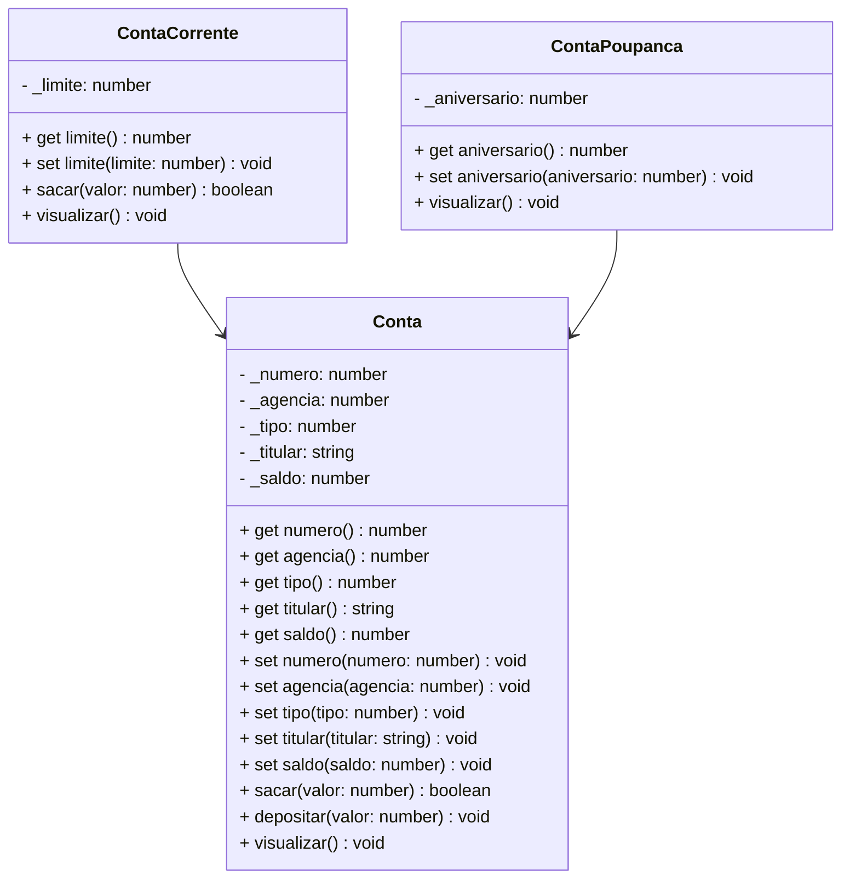

# Nexus Banking - TypeScript & POO

## Simulador Educacional de Sistema Bancário | Portfólio Profissional

<br />

<div align="center">
	
</div>
<br />

<div align="center">
  
  
  
  
  
  
  
</div>


------

<br />


O **Nexus Banking** é um projeto **educacional** desenvolvido em **TypeScript**, com foco em **Programação Orientada a Objetos (POO)** e **arquitetura modular**, simulando operações bancárias reais como **CRUD de contas, transferências, depósitos e saques**. O sistema conta com uma interface CLI estilizada com arte ASCII e suporte a cores no terminal.

**Objetivo:** Demonstrar **organização, domínio técnico, modelagem de domínio e boas práticas de engenharia de software** em um case prático de portfólio.

<br />

> [!WARNING]
>
> Este projeto possui **fins educacionais** e **não representa um sistema bancário real**. Foi desenvolvido para **aprendizado, demonstração técnica e portfólio profissional**.

<br />

Este projeto foi estruturado para:

- Demonstrar **competência técnica em TypeScript**
- Aplicar **POO em um cenário realista**
- Evidenciar **arquitetura limpa e organização de código**
- Simular **regras de negócio financeiras**
- Servir como **case técnico para recrutadores**

<br />

## Competências Técnicas Demonstradas


- Programação Orientada a Objetos (Encapsulamento, Herança, Polimorfismo)
- Modelagem de domínio orientada a objetos
- Arquitetura em camadas (**Model, Repository, Controller**)
- Tipagem forte com **TypeScript**
- Separação de responsabilidades
- Boas práticas de código e organização modular
- Simulação de regras financeiras
- Validação de entradas e controle de fluxo
- Interface CLI estilizada com arte ASCII e cores ANSI
- Estrutura pronta para evolução futura (API, DB, testes)

<br />

## Funcionalidades do Projeto


| Funcionalidade                    | Status |
| --------------------------------- | ------ |
| Criar conta bancária              | ✅      |
| Listar todas as contas            | ✅      |
| Buscar conta por número           | ✅      |
| Atualizar dados da conta          | ✅      |
| Apagar conta                      | ✅      |
| Sacar                             | ✅      |
| Depositar                         | ✅      |
| Transferência entre contas        | ✅      |
| Interface CLI interativa          | ✅      |
| Arte ASCII e cores no terminal    | ✅      |

<br />

## Diagrama de Classes




<br />

## Arquitetura do Projeto


Estrutura organizada para facilitar **manutenção, escalabilidade e leitura técnica**:

```text
📦 nexus-banking
 ┣ 📂 src
 ┃ ┗ 📂 util           # Utilidades e helpers (ex: Colors)
 ┣ 📜 Menu.ts          # Ponto de entrada principal
 ┣ 📜 package.json
 ┗ 📜 tsconfig.json
```

<br />

## Tecnologias Utilizadas


- **Linguagem & Runtime**

  - TypeScript
  - Node.js
  - ts-node

- **Ferramentas & Qualidade**
  - readline-sync (input interativo no terminal)
  - Git & GitHub
  - Mermaid (diagramas UML)
  - CLI interativa com cores ANSI (terminal)

<br />

## Como Executar


**1️⃣ Clone o repositório**

```bash
git clone https://github.com/sofiasbrinas/nexus-banking.git
```

**2️⃣ Acesse a pasta do projeto via terminal**

```bash
cd nexus-banking
```

**3️⃣ Instale as dependências**

```bash
npm install
```

**4️⃣ Execute a aplicação**

```bash
ts-node Menu.ts
```

<br />

## Implementações Futuras


- [ ]  Persistência com banco de dados
- [ ]  Testes automatizados (Jest)
- [ ]  API REST com NestJS
- [ ]  Interface Web (React)
- [ ]  Dockerização
- [ ]  CI/CD com GitHub Actions

<br />

## Contribuições


Sugestões, melhorias e pull requests são bem-vindos.

Você pode contribuir com:

- Melhorias arquiteturais
- Refatorações
- Testes automatizados
- Documentação

<br />

## Licença


Este projeto está sob licença **MIT** — livre para uso educacional e profissional.

<br />

## Autor


**Sofia — Desenvolvedora Full Stack**

🔗 **GitHub:** https://github.com/sofiasbrinas

🔗 **LinkedIn:** https://www.linkedin.com/in/sofia-sabrina-silva

Projeto desenvolvido para **aprendizado contínuo**, **demonstração técnica** e **portfólio profissional**.